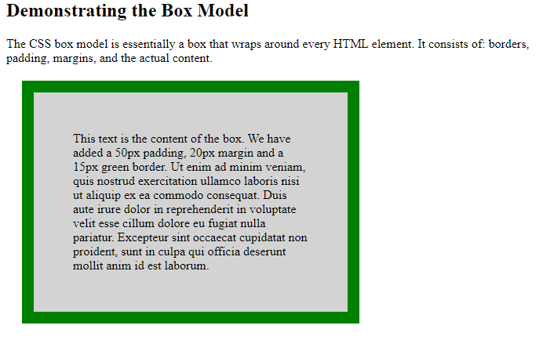
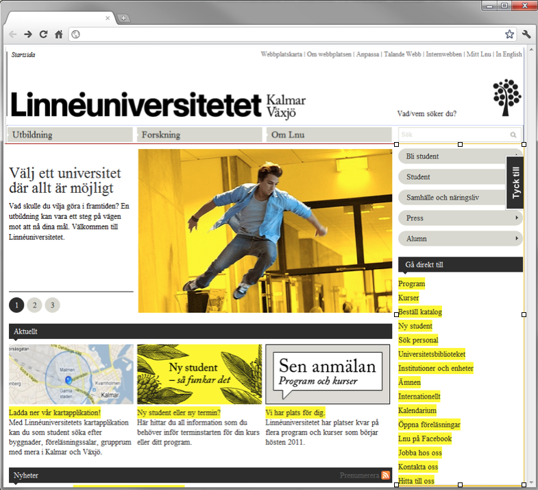
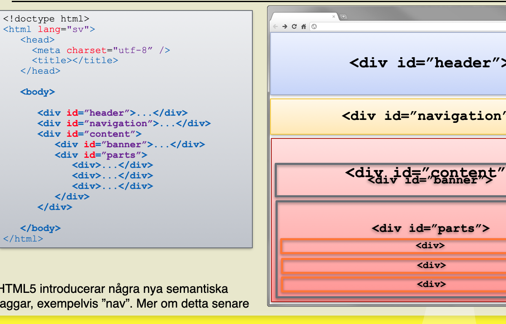
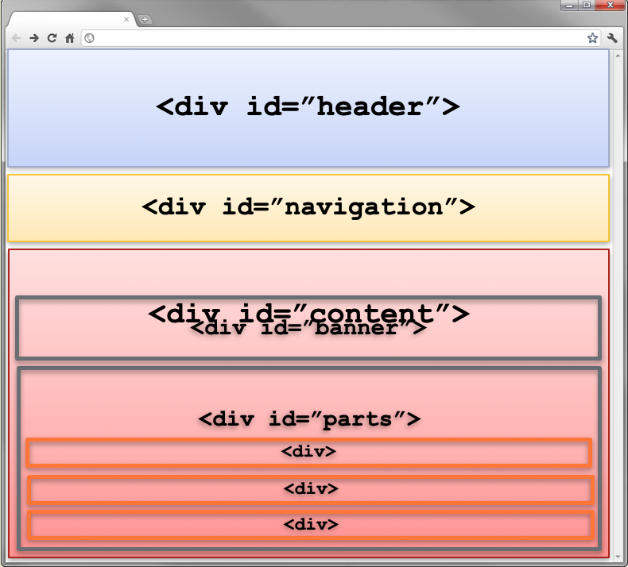
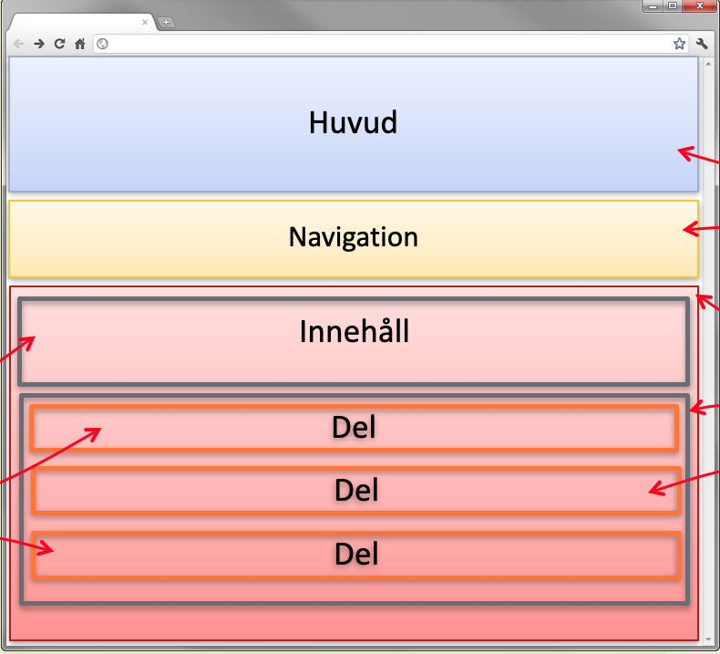
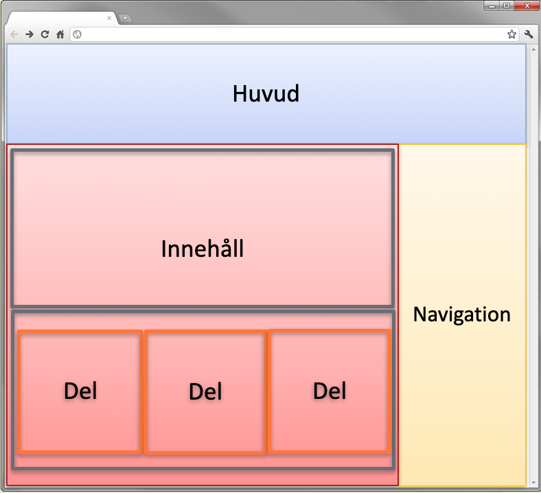

# CSS Övningar

## Instruktioner

**Filstruktur:**

1. Skapa en HTML-fil för varje övning: `css-övning1.html`, `css-övning2.html`, etc.
2. Använd intern CSS (`<style>` i `<head>`) eller extern CSS-fil enligt instruktioner
3. Testa dina lösningar i webbläsaren och justera vid behov
4. Ladda upp alla filer till GitHub när du är klar

**Extra träning:**
[W3Schools CSS Exercises](https://www.w3schools.com/css/css_exercises.asp) - Gör så många som du orkar!

---

## Övning 1 - CSS Selectorer

**Mål:** Lära dig använda olika typer av CSS-selectorer (element, class, id).

**Uppgift:**

1. Skapa en HTML-fil med koden nedan
2. Lägg till `<style></style>`-taggar innanför `<head>`
3. Använd **element-selector** för att ge alla `<p>`-taggar bakgrundsfärg
4. Lägg till samma **class** på alla `<h2>`-taggar och ge dem en bakgrundsfärg
5. Lägg till ett **id** på `<h1>`-taggen och ge den en annan bakgrundsfärg

**HTML-kod att använda:**

```html
<h1>Type selectors</h1>

<h2>Veggies</h2>
<p>
  Veggies es bonus vobis, proinde vos postulo essum magis
  <span>kohlrabi welsh onion</span> daikon amaranth tatsoi tomatillo melon azuki
  bean garlic.
</p>

<h2>Gumbo</h2>
<p>
  Gumbo beet greens corn soko <strong>endive</strong> gumbo gourd. Parsley
  shallot courgette tatsoi pea sprouts fava bean collard greens dandelion okra
  wakame tomato. Dandelion cucumber earthnut pea peanut soko zucchini.
</p>

<h2>Turnip</h2>
<p>
  Turnip greens yarrow ricebean rutabaga <em>endive cauliflower</em> sea lettuce
  kohlrabi amaranth water spinach avocado daikon napa cabbage asparagus winter
  purslane kale. Celery potato scallion desert raisin horseradish spinach
</p>
```

---

## Övning 2 - Tre sätt att lägga till CSS

**Mål:** Förstå skillnaden mellan inline, intern och extern CSS.

**Bakgrund:** Det finns tre sätt att lägga till CSS:

1. **Inline CSS** - direkt i HTML-elementet med `style`-attribut
2. **Intern CSS** - i `<style>`-taggar i `<head>`
3. **Extern CSS** - i separat `.css`-fil

**Uppgift:**

1. Skapa 3 rektanglar med `<div>`-taggar
2. Styla varje rektangel med en av de tre CSS-metoderna ovan
3. Alla rektanglar ska ha: bredd 200px, höjd 200px
4. Ge dem olika bakgrundsfärger: gul, röd och grön

**Tips:** För extern CSS, skapa en fil `styles.css` och länka med `<link rel="stylesheet" href="styles.css">`

---

## Övning 3 - Box Model

**Mål:** Förstå CSS box model (content, padding, border, margin).

**Uppgift:**

1. Använd HTML-koden nedan som grund
2. Lägg till CSS i `<style>`-taggen för att skapa box model enligt bilden
3. Div-elementet ska ha:
   - **Content**: texten som redan finns
   - **Padding**: 50px på alla sidor
   - **Border**: 15px grön ram
   - **Margin**: 20px på alla sidor

**HTML-kod:**

```html
<!DOCTYPE html>
<html>
  <head>
    <style>
      /* Din CSS här */
    </style>
  </head>
  <body>
    <h2>Demonstrating the Box Model</h2>

    <p>
      The CSS box model is essentially a box that wraps around every HTML
      element. It consists of: borders, padding, margins, and the actual
      content.
    </p>

    <div>
      This text is the content of the box. We have added a 50px padding, 20px
      margin and a 15px green border. Ut enim ad minim veniam, quis nostrud
      exercitation ullamco laboris nisi ut aliquip ex ea commodo consequat. Duis
      aute irure dolor in reprehenderit in voluptate velit esse cillum dolore eu
      fugiat nulla pariatur. Excepteur sint occaecat cupidatat non proident,
      sunt in culpa qui officia deserunt mollit anim id est laborum.
    </div>
  </body>
</html>
```

**Resultat ska se ut så här:**


---

## Övning 4 - CSS Flexbox Grunderna

**Mål:** Lära dig Flexbox genom interaktiv träning.

**Uppgift:**

1. **Läs teori:** [W3Schools CSS Flexbox](https://www.w3schools.com/css/css3_flexbox.asp)
2. **Praktisera:** [Flexbox Froggy](https://flexboxfroggy.com/#sv) - Spela alla nivåer!

**Tips:** Flexbox Froggy lär dig de viktigaste Flexbox-egenskaperna genom att hjälpa grodor hitta sina näckrosblad. Det är kul och effektivt!

---

## Övning 5 - Flexbox Layout Design

**Mål:** Skapa en komplett webbsideslayout med Flexbox.

**Bakgrund:** Detta är en layout baserad på Linnéuniversitetets gamla design. Du ska återskapa strukturen med div-element och Flexbox.

**Uppgift:**

1. Skapa HTML-struktur med div-element enligt bilderna nedan
2. Använd **Flexbox** för att positionera element horisontellt och vertikalt
3. Använd **procent** för bredder på div-element
4. Lägg till bakgrundsfärger för att tydligt se div-elementens gränser
5. Slutresultatet ska matcha den sista bilden

**Design-progression:**

**Steg 1:** Grundstruktur


**Steg 2:** Header-sektion


**Steg 3:** Huvudinnehåll


**Steg 4:** Sidebar och innehåll


**Steg 5:** Slutresultat


**Tips:**

- Använd `display: flex` på container-element
- Experimentera med `flex-direction`, `justify-content`, och `align-items`
- Använd `flex: 1` för att få element att fylla tillgängligt utrymme
