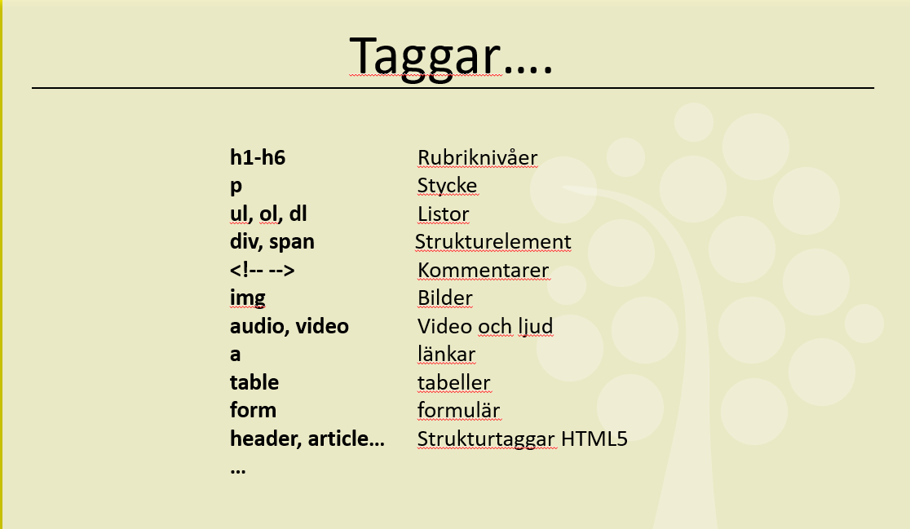

# HTML Övningar

**Instruktion:** Skapa en fil med namnet `övning1.html` etc. i mappen och gör övningen där. När du är klar laddar du upp ändringarna till Github. Gör sedan samma sak med övriga övningar.

## Övning 1 - Grundläggande HTML-struktur

**Mål:** Skapa en enkel webbsida enligt bilden nedan.

**Uppgift:**

- Du behöver inte ha exakt samma text som bilden visar
- Se till att använda alla typer av HTML-taggar som visas
- Använd valfritt eget innehåll

**Taggar att använda:**

- `<h1>`, `<h2>`, `
`, `<ul>`, `<li>`, `<a>`, ``

---

## Övning 2 - HTML-formulär

**Mål:** Skapa ett komplett formulär enligt bilden.

**Uppgift:**

- Återskapa formuläret som visas på bilden
- Vi har inte gått igenom alla typer av fält ännu - använd W3Schools eller Google för att hitta rätt input-typer
- Testa att formuläret fungerar (även om det inte skickas någonstans)

**Tips:** Använd olika `<input type="">` för olika fälttyper.

---

## Övning 3 - Block vs Inline element

**Mål:** Förstå skillnaden mellan block- och inline-element.

**Uppgift:**

- Testa några av HTML-taggarna som visas på bilden
- Undersök och dokumentera vilka som är Block-element och vilka som är Inline-element
- Skapa en HTML-sida där du visar skillnaden praktiskt

**Frågor att besvara:**

- Vad är skillnaden mellan block och inline?
- Vilka taggar är block-element?
- Vilka taggar är inline-element?
