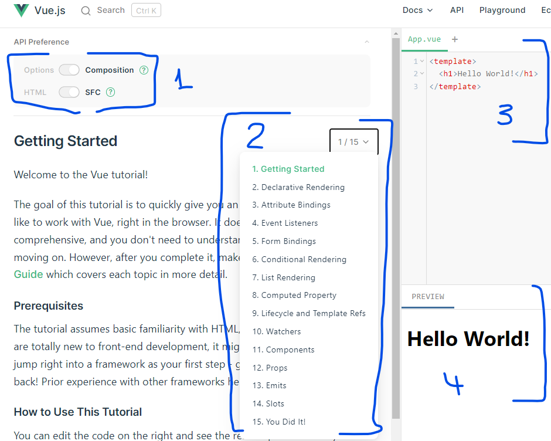

# VUE

Vue 3 är den senaste versionen av Vue och versionen vi kommer att använda.

## Intro

Nästa del i vår JavaScript resa är att lära oss om Vue.js för att enklare och snabbare kunna utveckla applikationer.

- Vue är ett progressivt open-source ramverk för att bygga användargränssnitt, till en början utvecklad av en Google avhoppare som heter Evan You, men underhålls idag av ett team.

- Core delen av ramverket är endast fokuserat på visningsskiktet och är enkelt att komma igång med.

- Vue är också fullt kapabelt att bygga sofistikerade applikationer (Single Page Applications).

- Vue är flexibelt och enkelt.

- Vue tillåter dig att använde det i en del av en befintlig applikation (plugin) eller hantera hela applikationen från start (CLI).

- Vue-Directives är den del av Vue.js som lägger speciell betydelse och beteende till vanliga html-element på sidan.

- Vue förser oss med reaktivitet vilket gör att våra vyer/sidor automagiskt uppdateras när vårat data ändras.

## Steg 1
Börja med att hämta ner powerpointen med namnet Vue.pptx och gå igenom innehållet på länken **Vue 3 Hands On** och lös övningsuppgifterna där. Vill man titta på en Youtube video om Vue 3 rekommenderas ** Vue 3 With Danny**.  
 
- [Vue 3 Hands On](https://vuejs.org/tutorial/#step-1)

På Vue Hands On får man en miljö för att öva och testa Vue.
Viktigt att man enligt bilden har:
1. Valt Composition och SFC.
2. Gör man alla uppgifter och förstått då har man bra koll på Vue.
3. Vi skriver vår Vue kod på över delen av höger sida.
4. Man ser resultatet på nedre delen av höger sida.

## Övergripande resurser för denna modul:
- [Vue 3 Hands On](https://vuejs.org/tutorial/#step-1)
- [Vue](https://vuejs.org/guide/quick-start.html)
- [Youtube - Vue 3 With Danny](https://www.youtube.com/watch?v=9whgkjxoCME)

## 1.1 Getting started
- [Vue 3 Hands On](https://vuejs.org/tutorial/#step-1)

## 1.2 Interpolation

[Vue.js Interpolation Declarative Rendering](https://vuejs.org/tutorial/#step-2)  

## 1.3 Attribute Binding
[Vue.js Attribute Binding](https://vuejs.org/tutorial/#step-3)  

## 1.4 Event hanterare (klicka på knapp)
[Vue.js Event Listeners](https://vuejs.org/tutorial/#step-4)  

## 1.5 Tvåvägs binding
[Vue.js Form Bindings](https://vuejs.org/tutorial/#step-5)  

## 1.6 Villkor
[Vue.js Conditional Rendering](https://vuejs.org/tutorial/#step-6)  

## 1.7 Visa Listor
[Vue.js List Rendering](https://vuejs.org/tutorial/#step-7)  

## 1.8 Computed Property

[Vue.js Computed Property](https://vuejs.org/tutorial/#step-8)  

## 1.9 Livscykel event

[Vue.js Lifecycle and Template Refs](https://vuejs.org/tutorial/#step-9)

## 1.10 Watchers
[Vue.js Watchers](https://vuejs.org/tutorial/#step-10)  

## 1.11 Components

[Vue.js Components](https://vuejs.org/tutorial/#step-11)  

## 1.12 Component Communication - Props
Skicka data från parent-component till en child-component  
[Vue.js Watchers](https://vuejs.org/tutorial/#step-12)  

## 1.12 Component Communication - Props
Skicka data från en parent-component till en child-component  

[Vue.js Props](https://vuejs.org/tutorial/#step-12)  

## 1.13 Component Communication - Emit Events
Skicka data från en child-component till en parent-component  

[Vue.js Emit Events](https://vuejs.org/tutorial/#step-13)  

## 1.14 Slots

### Resurser

[Vue.js Slots](https://vuejs.org/tutorial/#step-14)  

